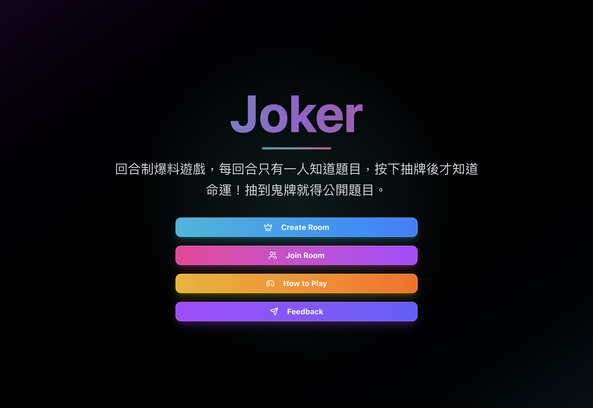

# Joker Frontend



## Description

The frontend interface for Joker, an online social game built with modern web technologies. Features real-time gameplay, responsive design, and intuitive user interactions.

## "Why?"

I've always been fascinated by social games after playing offline party games like "鬼牌" (a German social deduction game) with friends. These games create amazing moments of connection and laughter, but I noticed a common problem: we'd often run out of interesting questions or prompts, which would kill the momentum.

So I built this backend system that provides a flexible, extensible question database with real-time capabilities.

## 🚀 Quick Start

Navigate to [joker.jienian.tw](https://joker.jienian.tw) and start your social game!

Create rooms, add questions, and play with friends instantly.

## Contributing

## 🤝 Contributing

### Clone the repo

```bash
git clone https://github.com/y3933y3933/joker-frontend
cd joker-frontend
```

### Install dependencies

```bash
pnpm install
```

### Build the project

```bash
pnpm run build
```

### Run the project

```bash
pnpm run dev
```

### Submit a pull request

If you'd like to contribute, please fork the repository and open a pull request to the `main` branch.
